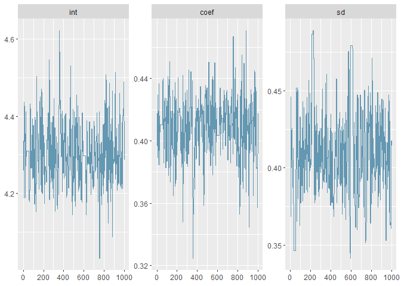

Examples with greta
-------------------

``` r
library(greta)
```

    ## 
    ## Attaching package: 'greta'

    ## The following objects are masked from 'package:stats':
    ## 
    ##     binomial, poisson

    ## The following objects are masked from 'package:base':
    ## 
    ##     %*%, backsolve, beta, colMeans, colSums, diag, forwardsolve,
    ##     gamma, rowMeans, rowSums, sweep

``` r
x <- iris$Petal.Length
y <- iris$Sepal.Length
plot(x,y)
```


``` r
int <- normal(0, 5)
coef <- normal(0, 3)
sd <- lognormal(0, 3)

mean <- int + coef * x
distribution(y) <- normal(mean, sd)
m <- model(int, coef, sd)
plot(m)
```

    ## Warning: package 'bindrcpp' was built under R version 3.4.4

``` r
draws <- mcmc(m, n_samples = 1000, chains = 1)
bayesplot::mcmc_trace(draws)
```


